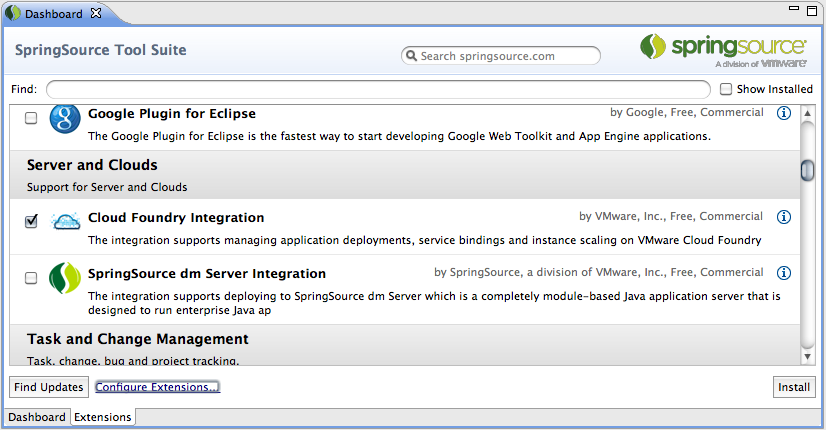

******************
認識 Cloud Foundry
******************

Cloud Foundry 是開放源碼的 PaaS 解決方案，支援多種程式語言、開發框架及資料庫等服務，而且更容易開發、測試及佈署。本書將從零開始，和學習者一起開啟雲端應用程式開發的大門。

開放源碼的平台即服務
================

平台即服務（Platform as a Service，簡稱PaaS）是一種雲端運算服務，介於軟體即服務與基礎設施即服務之間。它提供應用程式開發所需的基礎服務，讓開發者更省時省力達到事半功倍的成果。

在虛擬化技術領域相當具有優勢的 VMWare 公司，近年來致力於雲端解決方案的發展，例如提供給企業基礎設施即服務（IaaS）產品 vCloud 等，在雲端服務市場佔有一席之地。在併購 SpringSource 公司後，VMWare 的雲端產品布局更一舉打進平台即服務的層級，以下是 VMWare 近年的發展：

* 2009年併購 SpringSource 公司，其開放源碼的 Spring Framework 是被廣泛採用的 Java 應用程式開發框架。
* 2010年與 Google 公司合作，促使 Google App Engine 支援 Spring（Java）應用程式佈署。
* 2011年推出 Cloud Foundry，帶來業界第一個開放源碼的平台即服務產品。

不難想像 VMWare 為何要投入開放源碼的 PaaS 開發，畢竟架設 PaaS 需要 IaaS 的軟硬體基礎設施，而 VMWare 的主力產品就是提供 IaaS 所需的虛擬化技術。Cloud Foundry 讓擁有 IaaS 的廠商，可以進一步發展 PaaS 層級的服務，帶來更多雲端運算發展的想像空間。

應用程式發佈到 PaaS 雲端平台，就能直接利用平台提供的便利基礎服務。例如：免除軟硬體建置及伺服器安裝設定的麻煩、擁有充足的網路頻寬及較安全的防火牆等。應用程式因此具有更好的水平可延展性（horizontal scalability），可以隨時依負載量進行水平擴充（scale-out）。通常 PaaS 依實際用量計費，不必擔心軟硬體購置不足無法應付未來成長，也不用在初期過度投資而造成閒置浪費。

開發者可以放心踏進 Cloud Foundry 的世界，它是開放源碼軟體，採用和 Google Android 系統一樣的 Apache License 授權方式；因此除了商標之外，任何人皆可以複製、修改及散佈它的原始碼。除了 VMWare 自行架設提供的開放平台外，開發者也可以選擇自行架設或採用其他廠商提供的 Cloud Foundry 平台，因此有更多選擇較不受限制。

相容多種開放源碼的開發環境，也是 Cloud Foundry 的優點，許多開源世界的程式語言（例如 Java、Ruby 或 PHP）及資料庫（例如 MySQL 及 PostgreSQL），都可以在 Cloud Foundry 平台中運作；開發者可以直接利用已經熟悉的技術和工具，而免去重新學習的困擾。

Cloud Foundry 的平台及工具
==========================

Cloud Foundry 目前開放的網站有兩個，CloudFoundry.com 是 VMWare 公司以 vSphere 產品為基礎架構的開放服務，開發者只需要註冊一組帳號，就能將應用程式發佈到這個免費的 PaaS 平台。而 CloudFoundry.org 網站則是提供給開放原始碼社群，想要深入了解 Cloud Foundry 的技術、取得原始碼及參與討論等，可以利用這個網站提供的資訊。

VMWare 也發行名為 Micro Cloud Foundry 的虛擬機器，它的功能與 CloudFoundry.com 提供的服務相同，但是縮小到可以在開發者自有的機器上運作，利用 VMWare Player / Workstation / Fushion 等虛擬機器軟體即可執行。

開發者或企業在區域網路架設私有的 Micro Cloud Foundry，即可任意將應用程式發佈到這個迷你雲。由於 Micro Cloud Foundry 的功能和 CloudFoundry.com 一致，應用程式在開發過程可以先發佈到 Micro Cloud Foundry，功能、安全機制尚未完整的應用程式，就可以在這個沙盒中進行測試，等到準備正式上線時，就可以直接發佈到 CloudFoundry.com 或其他以 Cloud Foundry 建立的 PaaS 服務。

Cloud Foundry 的原始碼專案使用 GitHub 托管，目前發行的兩個主要專案有 VMC 及 VCAP。VMC 是應用程式開發端的工具，採用 Ruby 程式語言開發，用於發佈、維護管理 PaaS 的應用程式。VCAP（VMWare Cloud Application Platform）是伺服器端的軟體，同樣以 Ruby 開發，它包含提供 PaaS 服務所需的元件（如 cloud controller、health manager、dea、router、...等），雖然 VCAP 的目標是建立雲端的平台，但使用 VCAP 的硬體環境也可以很精簡，即使只用一部虛擬機器也可以開始建構 PaaS。

Cloud Foundry 的 GitHub 專案位址 https://github.com/cloudfoundry

VMC 是 command-line 的指令工具，開發者需要熟悉在終端機下使用文字指令工作。Cloud Foundry 也提供 Eclipse 軟體的 Plugin 套件，造福習慣使用圖形化整合開發環境的開發者，最簡易的使用方式就是先取得 SpringSource 推出的 STS（SpringSource Tool Suite）開發工具，再以內建的 Dashboard 加裝 Cloud Foundry 套件。

SpringSource Tool Suite http://www.springsource.com/developer/sts

目前 VMWare 官方版本的 Cloud Foundry，可以支援 Java、Ruby、JavaScript 等程式語言，其中 Java 部分亦包含愈來愈盛行的 JVM Scripting 語言如 Groovy 與 Scala，開發框架也支援廣受歡迎的 Spring、Lift、Play 及 Grails。而 JavaScript 所指並非前端瀏覽器的 JavaScript，而是可以在伺服器執行的 CommonJS 規範，也就是目前相當受矚目的 Node.js。至於 Ruby on Rails 相信大多開發者都已耳熟能詳，Sinatra 對 Ruby 開發者也不陌生。

======== ============
開發框架   程式語言
======== ============
Spring   Java
Lift     Scala
Play     Scala/Java
Grails   Groovy
Sinatra  Ruby
Rails    Ruby
Node.js  JavaScript
======== ============

Cloud Foundry 是開放源碼的 PaaS，其它廠商能夠自由參與開發社群，支援的程式語言及開發框架也日益豐富。目前比較活躍的社群夥伴開發商有：

1. Joyent

   提供軟體開發商雲端解決方案，其客戶包括 LinkedIn 等。Node.js 也是 Joyent 的產品，目前 Cloud Foundry 提供的 Node.js 就是由 Joyent 提供支援及維護。
2. ActiveState
   
   推出 Stackato 用於建構私有雲，是以 Cloud Foundry 為基礎、相容 vSphere 的產品，並可支援擁有廣大開發者使用的 ActivePython 及 ActivePerl。
2. AppFog
   
   目前提供 PHP Fog 是支援 PHP 及 MySQL 的 PaaS 服務，AppFog 也將支援 PHP 應用程式的 Cloud Foundry 開放原始碼回饋給社群。未來 AppFog 以 Cloud Foundry 發展的 PaaS，將能更廣泛支援 PHP、Node.js、Ruby、Python、Java、.NET 等技術。

除了對程式語言及開發框架的支援，Cloud Foundry 也提供服務（Services），包含關聯式資料庫 MySQL、PostgreSQL，以及 NOSQL 解決方案的 MongoDB 與 Redis，還有 RabbitMQ 訊息佇列服務。

若是 Cloud Foundry 及社群夥伴廠商提供的服務，也就是支援的程式語言、開發框架或資料庫種類，還是不能滿足應用程式開發的需求；或者需要自行架設私有雲 Private PaaS，就需要安裝建置 VCAP。VCAP 是 VMware's Cloud Application Platform 的縮寫，Cloud Foundry 提供的 PaaS 服務，就是利用 VCAP 建置的平台。

VCAP 是開放原始碼授權，開發者可以擴充它的程式，自行加上 Runtime（支援更多程式語言）、Framework（支援更多開發框架）或 Service（支援更多資料庫類型）。對於發展 PaaS 的廠商來說，使用 Cloud Foundry 開放的 VCAP 為基礎，就可以減少重複開發底層架構的成本，將重點擺在主要的功能擴充上，例如加上 Mono 以支援 .NET 應用程式等。

