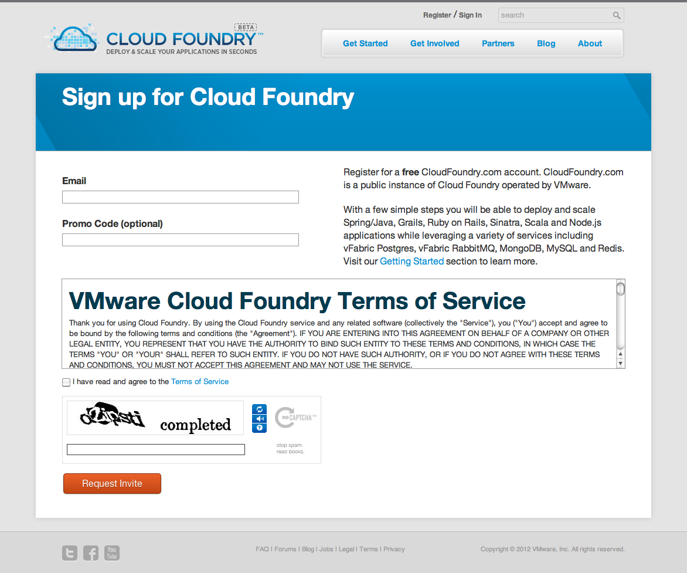

***************
開發環境安裝及設定
***************

註冊開發者帳號
============

開發者必須先在 Cloud Foundry 網站註冊一組帳號。

Cloud Foundry http://cloudfoundry.com

在輸入電子郵件信箱後，會收到系統自動回覆的信件，此時還需要等候審核，待審核通過後會再次收到通知信件。若讀者想要縮短通過審核的等待時間，可以利用搜尋引擎找一組 Cloud Foundry 的推廣代碼（promo code），在註冊時一併將代碼輸入，就有機會較快通過審核。

VMC 開發端工具安裝
================

註冊取得一組 Cloud Foundry 開發者帳號後，就可以開始存取 PaaS 提供的服務、發佈應用程式。目前有兩種方法，可以方便存取 PaaS 服務及發佈應用程式：

1. 使用 SpringSource Tool Suite（STS）或 Eclipse，搭配 Cloud Foundry 的擴充套件。
2. 使用 VMC 指令工具，需要在終端機文字模式下操作。

STS 是 VMWare 旗下 SpringSource 的開發工具，它是以 Eclipse 為基礎建立的整合開發環境。但是對學習 Cloud Foundry 來說，建議讀者先由 VMC 指令開始入門，比較能夠清楚瞭解操作的過程，本文的說明也將以 VMC 為主。

首先需要確認系統已經裝妥 Ruby 及 RubyGems，我們需要 RubyGems 提供的 gem 指令來安裝 VMC：

1. Windows 只要使用 Ruby 安裝程式，裝好的開發環境就已包含 Ruby 及 RubyGems。
2. Mac OS X 10.5 之後的版本，已經提供 Ruby 及 RubyGems；若需要手動安裝則建議使用 MacPorts，執行 ``sudo port install rb-rubygems``\ 。
3. Linux 可以透過套件管理工具安裝，例如 Ubuntu Linux 可以執行 ``sudo apt-get install ruby-full rubygems``\ 。

執行 ``gem --version`` 若顯示版本號碼，就表示系統已有 RubyGems 軟體。

接下來使用 ``gem install vmc`` 指令，將會使用 RubyGems 安裝 VMC 工具。需要注意的是，執行 ``gem`` 指令時，Mac 及 Linux 使用者需要注意權限問題，例如在指令前面加上 ``sudo`` 或是以 ``su`` 先切換成 root 身分。

執行 ``vmc version`` 檢查是否有版本編號顯示，若顯示版本編號則表示 VMC 安裝成功。

若一切順利，就可以開始使用 VMC 存取 Cloud Foundry 的服務。取得 VMC 指令的完整說明，可以使用 ``vmc help``\ 。

首先，我們使用 CloudFoundry.com 開放的 PaaS 服務，它提供的 URL 是 ``api.cloudfoundry.com``\ ，先執行 ``vmc target api.cloudfoundry.com`` 指令設定這組 URL。執行成功會有以下的訊息，若出現失敗訊息，請試著以瀏覽器打開網址，檢查網路連線是否正常，並嘗試多執行幾次指令。

::

    Successfully targeted to [http://api.cloudfoundry.com]

再來是以通過審核的帳號（電子郵件）及密碼，執行 ``vmc login`` 指令登入。

::

    Attempting login to [http://api.cloudfoundry.com]
    Email: 輸入電子郵件信箱（帳號）
    Password: 輸入密碼
    Successfully logged into [http://api.cloudfoundry.com]

執行 ``vmc info`` 可以檢視記憶體容量、服務及應用程式使用量。

::

    Usage:    Memory   (576.0M of 2.0G total)
              Services (0 of 16 total)
              Apps     (4 of 20 total)

從訊息可以發現，目前 CloudFoundry.com 提供開發者免費的額度包括：2GB記憶體容量、16組服務數量、20組應用程式數量。

其它可供查詢資訊的指令包括：

* ``vmc runtimes``
  
  顯示 PaaS 支援的程式語言類型。
* ``vmc frameworks``
  
  顯示 PaaS 支援的開發框架種類。
* ``vmc services``
  
  列出 PaaS 提供的服務。

更多關於 Cloud Foundry 的安裝說明，可以參考這份文件：

http://start.cloudfoundry.com/getting-started.html

