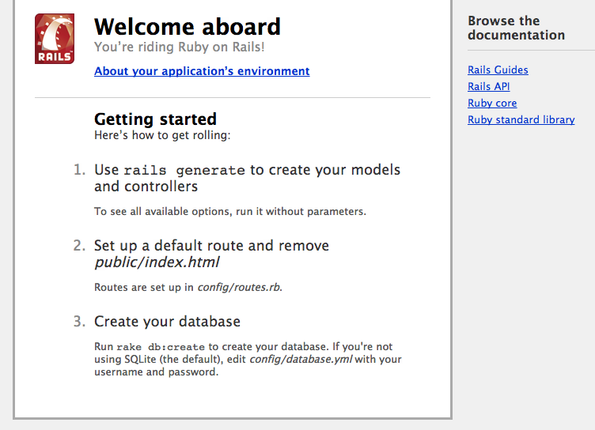

*************************
Ruby on Rails 開發整合實戰
*************************

Ruby on Rails 這套開放原始碼的網站開發框架，是 MVC 架構網站開發的典範，也受到非常多開發者喜愛；或許您曾經聽過 Heroku（http://www.heroku.com/）雲端運算平台，Heroku 主要支援的環境就是 Ruby，對於 Rails 專案佈署有很好的支援，同時也有提供開發者免費方案，可以讓每個新專案「無痛起步」。

Cloud Foundry 對 Ruby on Rails 也有良好的支援，對開發者來說，可以把它當作是 Heroku 以外的另一種開發階段的選擇；Cloud Foundry 提供更高的免費額度，例如高達 2GB 的記憶體，假設一個應用程式的 Instance 配置 64MB 記憶體，2GB 最高可以同時運行 32 個 Instances。

建立一個 Rails 應用程式
=====================

Ruby on Rails 是廣受網站開發者喜愛的開發框架，將 Rails 應用程式發佈倒 Cloud Foundry 也相當容易。我們並不打算用太多篇幅介紹 Ruby 及 Rails 的基礎，本文範例使用的指令及程式碼也會相當簡化，目的只是希望讓讀者能快速瞭解與 Cloud Foundry 相關的部份。

關於 Ruby on Rails 的教學，已經有相當多網路資源可供參考：

* Ruby Programming Language 中文官方網頁 http://www.ruby-lang.org/zh_TW/
* Rails 官方網站 http://rubyonrails.org/
* Ruby on Rails 實戰聖經 http://ihower.tw/rails3/
* 良葛格的 Rails 學習筆記 http://caterpillar.onlyfun.net/Gossip/Rails/
* Rails 101 - 火速學會 Ruby on Rails（付費電子書） http://rails-101.logdown.com/

如果您正在為「如何建立 Ruby on Rails 的開發環境？」苦惱，請相信我：「先買一台 MacBook 筆電就對了！」

首先，需要先建立 Rails 開發環境，使用 RubyGems 安裝 Rails。如果您曾經安裝過 Rails，且版本為 3.1 或更新，請略過以下安裝的步驟。

::

    gem install rails

執行以下指令查看版本編號，確認 Rails 已安裝成功。

::

    rails --version

第一個應用程式以陽春版部落格為例，首先建立一個命名為「blog」的新專案。

::

    rails new blog
    cd blog

記得要使用 bundle 指令，安裝專案依賴的相關套件。

::

    bundle package
    bundle install

接下來需要設定 Assets，也就是位於 ``app/assets`` 資料夾下的 CSS、JavaScript 及圖片檔等；這些檔案需要預先經過編譯處理，才能順利發佈到 PaaS。

修改 ``config/environment/production.rb`` 設定。

::

    config.serve_static_assets = true
    config.assets.compile = true

修改 ``config/application.rb`` 設定。

::

    config.assets.enabled = true

輸入以下指令，立即清除並重新編譯 Assets。

::

    RAILS_ENV=production bundle exec rake assets:clean
    RAILS_ENV=production bundle exec rake assets:precompile

Rails 預設使用 WEBrick 作為開發階段的測試伺服器，以下的指令會建立一個本地的 HTTP 服務並使用 3000 作為連接埠。使用瀏覽器開啟「http://localhost:3000」，如果看到 Rails 提供的專案預設畫面，就代表應用程式正在執行且沒有發生錯誤。

::

    rails server

測試完畢後，使用 Ctrl+C 停止伺服器。

建立資料庫存取服務
===============

利用 VMC 工具，將前一節建立的 Rails 新專案發佈到 Cloud Foundry：

::

    vmc push

發佈過程需要幫應用程式命名，假設輸入的名稱是「myfirstblog」，發佈成功後就能利用以下網址瀏覽：

http://myfirstblog.cloudfoundry.com

資料庫的部份以 MySQL 為例，在許多書籍或教學文章，都可以找到 Rails + MySQL 的範例，對於準備佈署到 Cloud Foundry 的 Rails 應用程式，資料庫的設定方式並沒有差異。先將 Gemfile 修改如下：

::

    # 註解原設定
    # gem 'sqlite3'

    # 加上以下設定
    group :development do
      gem 'sqlite3'
    end
       
    group :production do
      gem 'mysql2'
    end

上述的設定使 Rails 專案在開發階段使用 SQLite 資料庫，但是發佈到 Cloud Foundry 時則使用 MySQL。分別在 Development、Test 及 Production 不同階段使用不同的資料庫來源，對於準備佈署到雲端架構的應用程式，通常是一個理想的規劃方式。

另外是針對 Ruby 1.9 版本，同時也需要修改 Gemfile 的 ``jquery-rails`` 設定如下：

::

    # gem 'jquery-rails'
    gem 'cloudfoundry-jquery-rails'

修改上述設定後，記得重新安裝依賴的套件：

::

    bundle package
    bundle install

接下來使用 Rails 的 Scaffold 功能快速建立應用程式的雛形，先建立一個命名為「Post」的 Model，包含 name、title、content 三項資料欄位。

::

    rails generate scaffold Post name:string title:string content:text
    rake db:migrate

再次執行 ``rails server`` 啟動本地端的測試伺服器，並瀏覽「http://localhost:3000/posts」，正常情況下可看到「Listing posts」畫面，此時即可測試列表、新增、修改及移除的基本操作。

接下來我們需要繼續修改資料庫存取的設定，讓專案準備好佈署到 Cloud Foundry，這也是入門者比較容易感到複雜的地方；由於 Cloud Foundry 提供的 MySQL 資料庫服務，是由雲端運算架構提供，因此我們無法明確在設定檔指定相關參數。

在典型的 Rails 設定中，搭配 MySQL 資料庫，通常只要在 ``config/database.yml`` 加上參數設定，例如以下是一個設定的範例。

::

    production:
      adapter: mysql2
      encoding: utf8
      reconnect: false
      database: dbname
      host: localhost
      port: 3306
      username: root
      password: somepwd
      pool: 5
      timeout: 5000
      #socket: /tmp/mysql.sock

上面的設定範例僅供參考，並無法在 Cloud Foundry 環境下使用；我們需要讓專案在啟動時「動態」取得資料庫參數。

在設定資料庫之前，需要先以 VMC 工具建立 Cloud Foundry 的資料庫服務。

::

    vmc create-service

執行這個指令會顯示以下的選單，輸入 5 選擇 MySQL 資料庫。

::

    1: rabbitmq
    2: mongodb
    3: redis
    4: postgresql
    5: mysql
    Which service would you like to provision?: 

新資料庫服務建立成功後，系統會回應 OK 的訊息如下。

::

    Creating Service [mysql-50d38]: OK

其中 **mysql-50d38** 就是新服務的名稱，我們還需要將這個服務和應用程式關聯起來。

::

    vmc bind-service mysql-50d38 myfirstblog

如果需要檢視應用程式與服務之間的關聯，可以執行 ``vmc apps`` ，以下是輸出的範例：

::

    +-------------+----+---------+------------------------------+-------------+
    | Application | #  | Health  | URLS                         | Services    |
    +-------------+----+---------+------------------------------+-------------+
    | myfirstblog | 1  | RUNNING | myfirstblog.cloudfoundry.com | mysql-50d38 |
    +-------------+----+---------+------------------------------+-------------+

應用程式如何「動態」取得資料庫的參數設定呢？方法是透過 ``ENV['VCAP_SERVICES']`` 環境變數；Cloud Foundry 會將應用程式相關服務的設定，藉由此變數傳遞給應用程式。\ ``ENV['VCAP_SERVICES']`` 的內容是 JSON 格式，以下的參數內容範例僅供參考。

::

    {
        "mysql-5.1": [{
            "name": "mysql-50d38",
            "label": "mysql-5.1",
            "plan": "free",
            "tags": ["mysql","mysql-5.1","relational"],
            "credentials": {
                "name":"dfe428022cd5f4f7e901da2a9ff3ef9a7",
                "hostname":"172.30.48.22",
                "host":"172.30.48.22",
                "port":3306,
                "user":"umHe9MCRD6jVV",
                "username":"umHe9MCRD6jVV",
                "password":"pktKbJgobh5Uo"
            }
        }]
    }

因此，在 database.yml 設定中，必須在執行階段從變數中動態獲取設定。

::

    production:
      adapter: mysql2
      encoding: utf8
      reconnect: false
      database: <%= JSON.parse(ENV['VCAP_SERVICES'])['mysql-5.1'].first['credentials']['name'] rescue 'blog' %>
      host: <%= JSON.parse(ENV['VCAP_SERVICES'])['mysql-5.1'].first['credentials']['host'] rescue 'localhost' %>
      port: <%= JSON.parse(ENV['VCAP_SERVICES'])['mysql-5.1'].first['credentials']['port'] rescue '3306' %>
      username: <%= JSON.parse(ENV['VCAP_SERVICES'])['mysql-5.1'].first['credentials']['username'] rescue 'root' %>
      password: <%= JSON.parse(ENV['VCAP_SERVICES'])['mysql-5.1'].first['credentials']['password'] rescue '' %>
      pool: 5
      timeout: 5000

如果想知道 ``ENV['VCAP_SERVICES']`` 變數實際的內容，可以利用 Rails 的 Controller 或 View 將內容印出顯示；例如將以下的 Ruby 程式碼加入 views/layouts/application.html.erb 的 <body>...</body> 區塊內。請注意避免將這些資訊洩漏，以免造成應用程式安全漏洞。

::

    ENV: <%= ENV['VCAP_SERVICES'] %>

資料庫的設定完成後，需要再執行一次 VMC 更新已發佈過的應用程式：

::

    vmc update myfirstblog

在應用程式更新成功後，即可瀏覽「http://myfirstblog.cloudfoundry.com/posts」，測試包含資料庫操作的應用程式。
