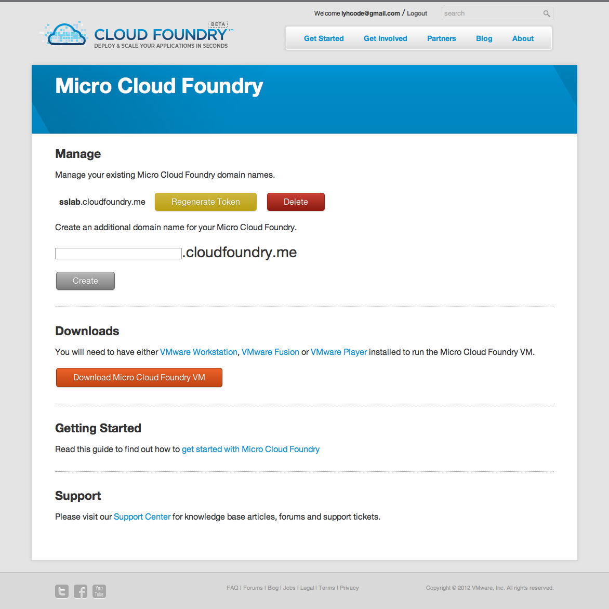
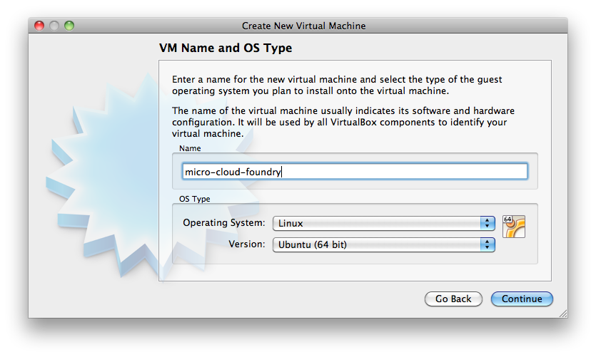
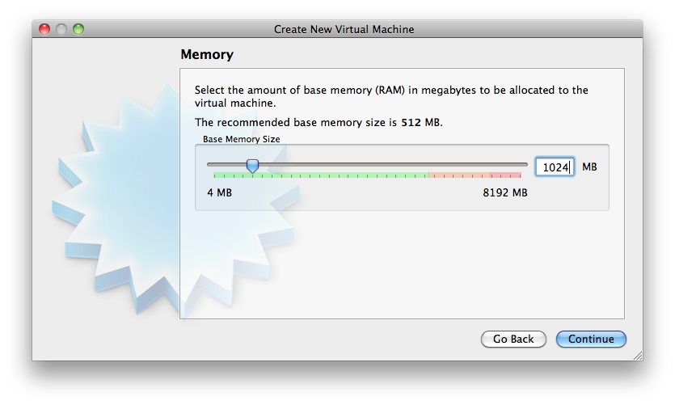
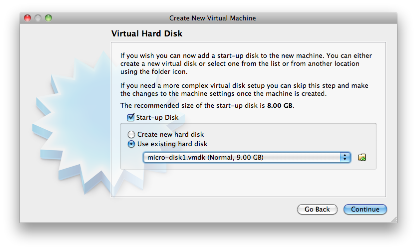
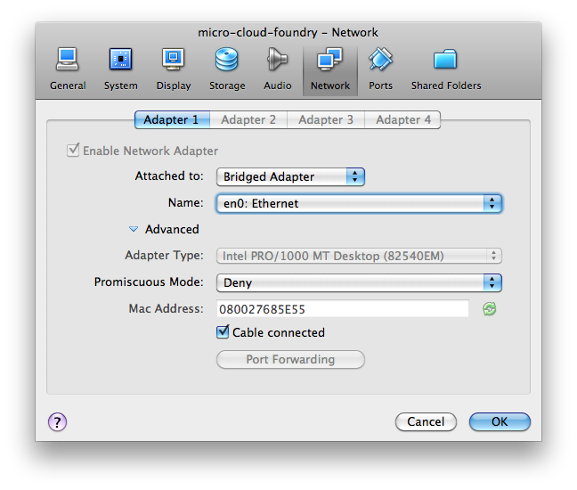
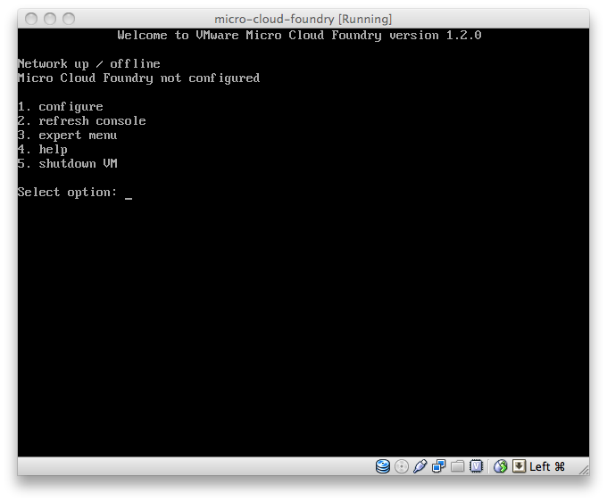
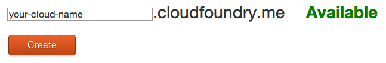
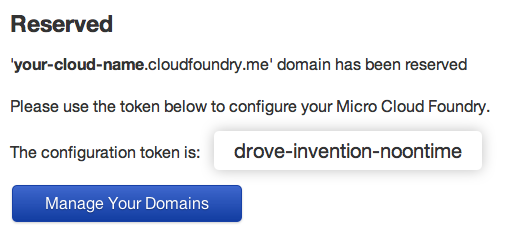
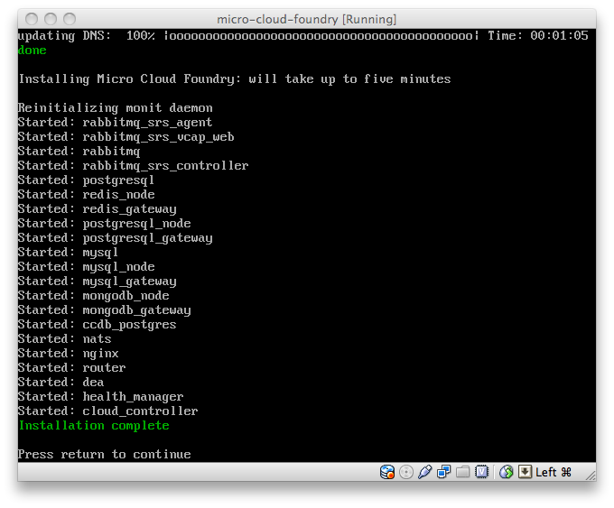
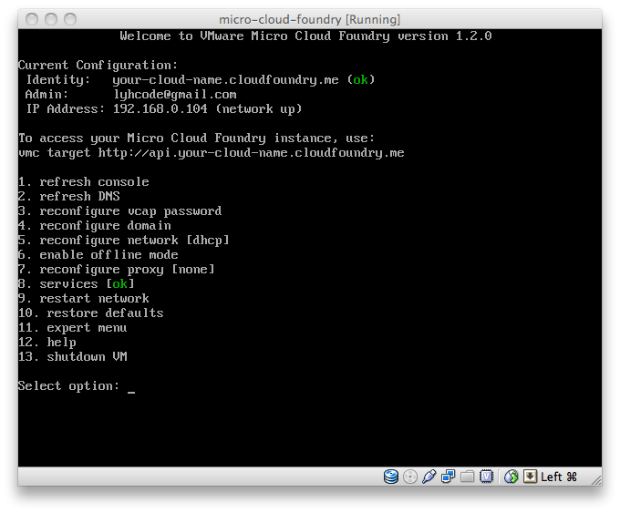

***************
建置私有雲測試平台
***************

Micro Cloud Foundry 是開發階段測試用的微型 PaaS，只需要搭配 VMWare 或 VirtualBox 虛擬機器軟體，就可以在自己的機器上執行。

Micro Cloud Foundry 介紹
========================

將應用程式發佈到 Cloud Foundry，就不必再自行架設維護伺服器；雖然這麼做很方便，但是有些情況下，開發者仍需要自己的私有測試環境，此時 Micro Cloud Foundry 就能派上用場。

Micro Cloud Foundry 讓開發者可以在自己的電腦建立完整的 PaaS 測試環境，且功能與正式發佈用的 Cloud Foundry 相同，但體積縮小到只要一部虛擬機器就能執行。Micro Cloud Foundry 需要虛擬機器軟體，可以搭配 VMWare 自家的 Player 或 Workstation 版本。

通常開發框架（frameworks）會提供測試的方法，例如 Ruby on Rails 使用 WEBrick 作為開發階段的測試伺服器；開發者可以先在自己的開發環境進行單元或整合測試，確認功能沒有問題再發佈到 PaaS。但是開發者自己的系統環境不可能和 PaaS 相同，當應用程式發佈到 PaaS 之後，仍需要再進行測試才會知道是否有問題。

Micro Cloud Foundry 讓應用程式在正式佈署前，先在一個微型的 PaaS 沙盒（sandbox）中測試，可以避免已經發佈後才發現程式的問題。

同一份應用程式，開發者可以選擇：

1. 以不同的應用程式名稱發佈。
2. 發佈至不同的 Target（目標伺服器）。

Micro Cloud Foundry 提供給開發者一個自己可以掌控的目標伺服器，架設在自己主機上的虛擬機器，甚至只允許區域網路的其他主機連線。這個微型的 PaaS 就是開發階段測試專用，讓尚處於開發、測試階段的應用程式，不必貿然發佈到正式（production）的 PaaS 服務，只要利用開發端的環境就可以測試發佈後的應用程式。

由於 Micro Cloud Foundry 與 Cloud Foundry 的 PaaS 服務功能完全相同，在應用程式發佈時，可以快速設定切換成不同的 Target。

接下來，我們就開始動手安裝設定並執行 Micro Cloud Foundry。

Micro Cloud Foundry 安裝篇
=========================

以個人帳號密碼登入 cloudfoundry.com 網站，可以看到 Manage 及 Downloads 兩個項目。點選「Download Micro Cloud Foundry VM」取得最新版的虛擬機器壓縮檔（例如：micro-1.2.0.zip），將下載的檔案解壓縮至桌面或其他磁碟位置。

將下載的檔案解壓縮，會得到 micro-disk1.vmdk 及 micro.vmx 兩個檔案。其中 vmx 是 VMWare 的虛擬機器設定檔，可以直接使用下列的軟體開啟。

* VMWare Workstation
* VMWare Fusion
* VMWare Player

其中 Fusion 是 Mac OS X 系統專用，而 Workstation 及 Player 兩個版本則支援 Windows 及 Linux 作業系統。Fusion 與 Workstation 需要付費購買正版軟體，一般開發者若沒有進階需求，只要下載安裝免費的 VMWare Player 版本即可。

Micro Cloud Foundry 官方建議搭配 VMWare 的虛擬機器軟體，可以不必多加設定就能立即執行。

另一種可以執行 Micro Cloud Foundry 的虛擬機器軟體是 VirtualBox，它支援 Windows、Linux 及 Mac OS X 等作業系統，而且是免費的開放源碼軟體（為 Oracle 所有）。VirtualBox 功能和 VMWare 的虛擬機器軟體類似，並且也支援 VMWare 的 vmdk 虛擬磁碟檔案格式；因此 VirtualBox 能夠透過以下的設定步驟，成功執行 Micro Cloud Foundry。

建立新的虛擬機器，作業系統類型選擇 Linux / Ubuntu (64bit)。

記憶體建議至少配置 1024MB 以上。

不必建立新的虛擬磁碟，直接選擇解壓縮得到的 micro-disk1.vmdk 即可。

將網路設定為 Bridged Adapter 模式。

利用建立完成的虛擬機器開機，等待一段時間後即可看見 Micro Cloud Foundry 的主畫面。

Micro Cloud Foundry 設定篇
==========================

使用虛擬機器軟體執行 Micro Cloud Foundry，開機後會自動出現文字選單畫面。

1. configure （設定）
2. refresh console （重新顯示畫面）
3. expert menu （進階功能）
4. help （輔助說明）
5. shutdown VM （關機）

第一次執行需要先進行設定，選擇 configure（按下數字鍵 1 及 Enter 鍵），就會要求輸入一組新密碼。

::

    Set password Micro Cloud Foundry VM user (vcap)
    Password: ********
    Confirmation: ********

接下來是網路配置設定，可以選擇 DHCP 或 Static 其中一種模式。一般來說，如果只是作為開發階段的測試用途，使用區網 IP 位址即可。

::

    1. DHCP
    2. Static

再次登入 cloudfoundry.com 網站取得「token」代碼，需要輸入一組子網域名稱（英文小寫或數字、可用「-」符號）；在本文的範例中，我們使用 your-cloud-name 這個命名。

設定完成後，會顯示一組「configuration token」，務必將它記下來。

如果忘記 token，可以按 Regenerate Token 重新產生一組（但無法找回已遺失的 Token）。

目前 Cloud Foundry 無法支援自訂網域名稱，只能用 \*.cloudfoundry.me 的子網域；所以也是先搶先贏，讀者可以儘快將想要的名稱註冊保留。

::

    Enter Micro Cloud Foundry configuration token or offline domain name:

接下來等待 DNS 更新及安裝動作完成。

設定完成之後回到主畫面（範例）。

用 ping 指令測試，出現虛擬機器的 IP 表示 Cloud Foundry 的 DNS 設定已經更新。

::

    ping your-cloud-name.cloudfoundry.me
    ping api.your-cloud-name.cloudfoundry.me

使用瀏覽器或 ``curl`` 指令，可以測試 PaaS 服務是否已成功啟用。

::

    curl http://api.your-cloud-name.cloudfoundry.me

如果服務尚未建立完成，會得到以下的錯誤訊息。

::

    Error (JSON 404): VCAP ROUTER: 404 - DESTINATION NOT FOUND

需要等待多久必須視機器的效能而定；當服務已經啟用完成，就可以得到以下的歡迎訊息。

::

    Welcome to VMware's Cloud Application Platform

使用 vmc 指令將目標伺服器（target）切換為 Micro Cloud Foundry 專用的 URL：

::

    vmc target api.your-cloud-name.cloudfoundry.me

因為新建的 Micro Cloud Foundry 並沒有內建開發者的帳號密碼，在 Micro Cloud Foundry 使用的帳號密碼與 cloudfoundry.com 註冊的帳號無關，即使已經在 cloudfoundry.com 註冊過帳號，使用 Micro Cloud Foundry 時，仍需要另外註冊新的帳號密碼。這部份並不需要等待審核，使用 vmc 的 register 指令，就可以建立一組新帳號。

::

    vmc register

輸入電子郵件及密碼（可自訂、與 cloudfoundry.com 的帳號無關），等待新帳號建立完成。

::

    Email: 設定電子郵件信箱
    Password: 密碼
    Verify Password: 確認密碼
    Creating New User: OK
    Attempting login to [http://api.your-cloud-name.cloudfoundry.me]
    Successfully logged into [http://api.your-cloud-name.cloudfoundry.me]

執行 ``vmc register`` 指令之後，除了會建立一組帳號外，也會自動完成登入。若日後需要重新登入，或改以其它帳號登入，就必須執行 ``vmc login`` 指令。

使用 ``vmc target`` 設定為 Micro Cloud Foundry 的 URL（api.your-cloud-name.cloudfoundry.me）後，就可以使用 ``vmc push`` 發佈應用程式。Micro Cloud Foundry 的操作方法，與 Cloud Foundry（api.cloudfoundry.com）完全相同；在 Micro Cloud Foundry 發佈的應用程式與服務，會在虛擬機器中運作，速度比較緩慢，僅適合作為開發階段的測試用途。

